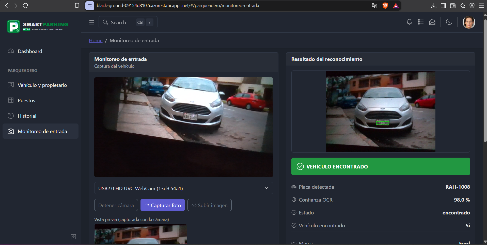
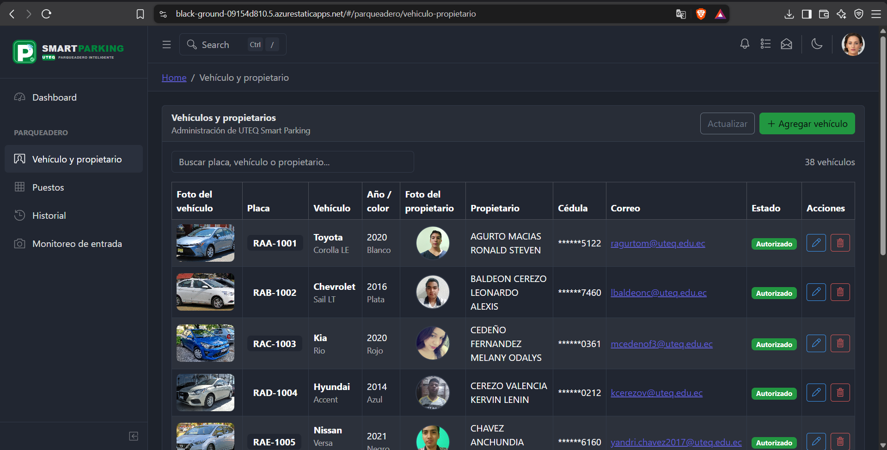
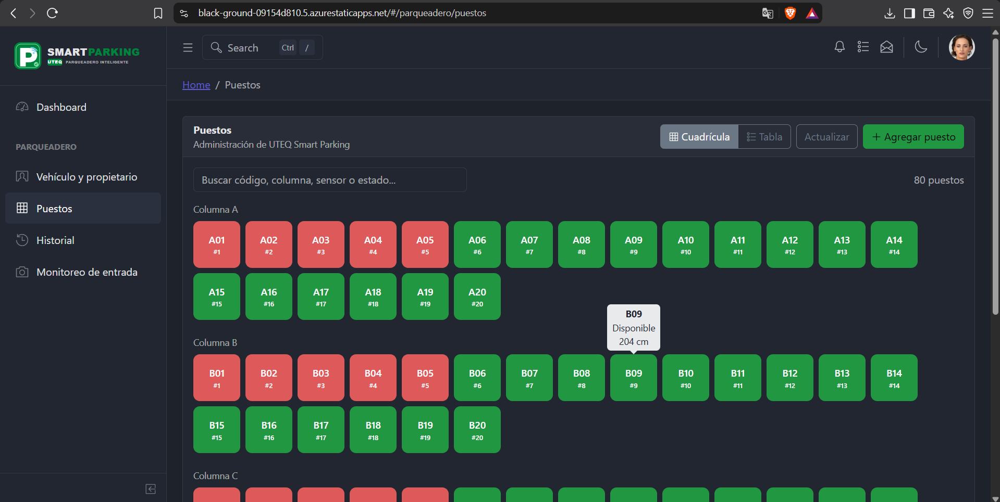
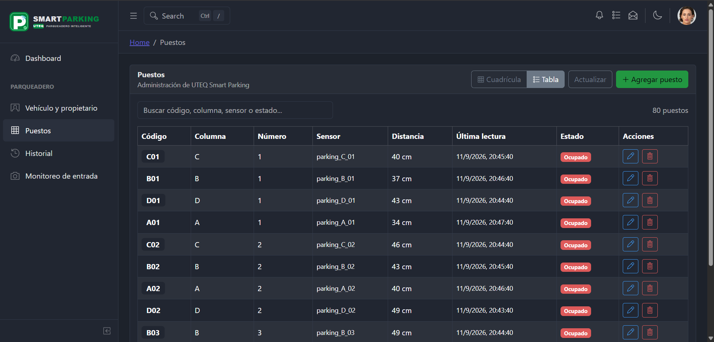
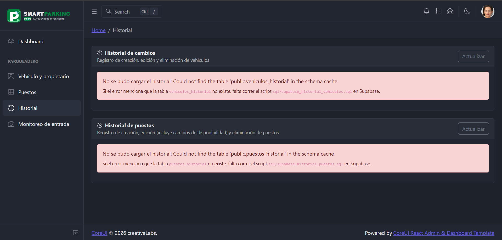

# 🅿️ UTEQ Smart Parking — Sistema de Gestión de Vehículos

<div align="center">

### Plataforma administrativa para el control de vehículos autorizados y propietarios

[](https://react.dev/)
[](https://vitejs.dev/)
[](https://coreui.io/)
[](https://supabase.com/)
[](LICENSE)

</div>

---

## 🖼️ Vista General

UTEQ Smart Parking es una solución web moderna para gestionar los vehículos y propietarios habilitados dentro de la Universidad Técnica Estatal de Quevedo. La aplicación combina un panel administrativo intuitivo, un módulo de monitoreo de entrada y una capa de seguridad basada en Supabase para ofrecer una experiencia eficiente y confiable.

### Flujo principal de acceso

La funcionalidad más destacada del sistema es el monitoreo de entrada: permite tomar una foto del vehículo desde la cámara o cargar una imagen, enviar ese archivo al servicio OCR y consultar si la placa corresponde a un registro válido.

### Capturas de pantalla

#### 🎥 Monitoreo de Entrada con OCR

*Proceso central del sistema: captura o carga de una imagen, vista previa del vehículo y resultado del reconocimiento de placa con nivel de confianza y estado del registro.*

#### 📋 Gestión de Vehículos y Propietarios

*Panel principal con tabla interactiva, datos del propietario, fotografías, y acciones para editar o eliminar registros.*

#### 🅿️ Puestos de Parqueadero — Vista en Cuadrícula

*Visualización organizada de los puestos de estacionamiento con indicadores visuales de disponibilidad ocupación.*

#### 📊 Puestos de Parqueadero — Vista en Tabla

*Vista alternativa con datos detallados por puesto, incluyendo código, columna, sensor y distancia.*

#### 📝 Historial de Cambios

*Registro completo de acciones realizadas sobre los datos, incluyendo creación, edición y eliminación.*

---

## 📌 Descripción del Proyecto

Este proyecto fue desarrollado con React 19, CoreUI 5 y Supabase para ofrecer una plataforma administrativa completa para la gestión vehicular en un entorno universitario.

Incluye:

- CRUD completo para vehículos, propietarios y puestos
- Validaciones avanzadas en el frontend
- Interfaz responsiva y moderna
- Manejo de errores con mensajes claros
- Notificaciones visuales para acciones exitosas o fallidas
- Integración con OCR para detectar placas desde imágenes
- Seguridad con Row Level Security (RLS) en Supabase

### Características principales

- 🎥 Monitoreo de entrada mediante cámara o carga de imagen
- 🤖 Reconocimiento OCR de placas con identidad, confianza y estado
- 📊 Panel administrativo fácil de usar
- 🔄 CRUD completo con filtros y búsqueda
- 📱 Diseño adaptable a distintos tamaños de pantalla
- ✅ Validaciones robustas de entrada de datos
- 🔒 Seguridad con políticas de acceso en base de datos
- ⚡ Indicadores de carga durante operaciones asincrónicas
- 🎯 Notificaciones tipo toast para feedback inmediato
- 📧 Protección de datos sensibles con cédulas enmascaradas

---

## 📑 Índice

- [Requisitos](#requisitos)
- [Instalación rápida](#instalación-rápida)
- [Tecnologías utilizadas](#tecnologías-utilizadas)
- [Funcionalidades clave](#funcionalidades-clave)
- [Estructura del proyecto](#estructura-del-proyecto)
- [Configuración de Supabase y RLS](#configuración-de-supabase-y-rls)
- [Variables de entorno](#variables-de-entorno)
- [Monitoreo de entrada](#monitoreo-de-entrada)
- [Despliegue en Azure](#despliegue-en-azure)
- [Validaciones del formulario](#validaciones-del-formulario)
- [Notas de seguridad](#notas-de-seguridad)
- [Guía de desarrollo](#guía-de-desarrollo)
- [Licencia](#licencia)
- [Autor](#autor)

---

## ✅ Requisitos

Antes de comenzar, asegúrate de tener instalado lo siguiente:

- Node.js 18 o superior
- npm
- Git
- Una cuenta activa en Supabase
- Un editor de código, preferiblemente VS Code

---

## 🚀 Instalación rápida

```bash
# 1. Clonar el repositorio
git clone <URL_DE_ESTE_REPOSITORIO>
cd Parqueadero

# 2. Instalar dependencias
npm install

# 3. Crear archivo local de configuración
cp .env.local.example .env.local
# Edita .env.local con tus credenciales de Supabase

# 4. Iniciar en modo desarrollo
npm run dev
```

Luego, abre esta ruta en tu navegador:

[http://localhost:5173/parqueadero/vehiculo-propietario](http://localhost:5173/parqueadero/vehiculo-propietario)

---

## 🛠️ Tecnologías utilizadas

| Tecnología | Uso principal | Versión |
|:---|:---|:---:|
| **React** | Interfaz de usuario | 19+ |
| **Vite** | Bundler y servidor de desarrollo | Latest |
| **CoreUI React** | Componentes administrativos | 5.x |
| **Supabase** | Base de datos y backend asistido | Cloud |
| **React Router** | Navegación de rutas | 7.x |
| **SCSS** | Estilos y diseño visual | Standard |
| **Axios** (vía Supabase JS) | Comunicación HTTP con APIs | - |
| **Azure** | Despliegue y servicio OCR | Cloud |

---

## 🎯 Funcionalidades clave

### 📋 Gestión completa (CRUD)

| Operación | Descripción | Detalles |
|:---|:---|:---|
| **📖 Listar** | Muestra todos los vehículos y propietarios registrados | Incluye foto, placa, marca, modelo, año, color, cédula enmascarada, correo y estado |
| **🔎 Buscar** | Filtra registros en tiempo real | Busca por placa, marca, modelo, color, propietario y correo institucional |
| **📄 Paginación** | Navega entre resultados | 10 registros por página con botones de avance y retroceso |
| **➕ Crear** | Registra nuevos vehículos | Formulario validado en modal |
| **✏️ Editar** | Actualiza información existente | Carga los datos automáticamente y guarda cambios en vivo |
| **🗑️ Eliminar** | Quita registros de forma segura | Requiere confirmación antes de borrar |
| **💬 Notificaciones** | Informa el resultado de cada acción | Toasts, alertas y estados de carga |

### 🔒 Seguridad

- ✅ Habilitación de RLS en Supabase
- 🔐 Cédula enmascarada en listados
- 🔑 Uso exclusivo de claves públicas (`anon`) en el cliente
- ✔️ Validaciones del lado del cliente para mejor experiencia
- 🛡️ Validaciones adicionales en la capa de datos para mantener integridad

---

## 📁 Estructura del proyecto

```text
Parqueadero/
├── 📄 README.md                    # Este archivo
├── 📄 DEVELOPMENT.md               # Guía de desarrollo
├── 📄 ARCHITECTURE.md              # Arquitectura y decisiones técnicas
├── 📦 package.json                 # Scripts y dependencias
├── 🔧 vite.config.mjs              # Configuración de Vite
├── 🔧 eslint.config.mjs            # Reglas de linting
├── 🔐 .env.local.example           # Plantilla de variables de entorno
│
├── 📂 public/                      # Archivos públicos
│   └── manifest.json               # Manifest PWA
│
├── 📂 docs/                        # Documentación y recursos visuales
│   ├── 1.png                       # Vehículos y propietarios
│   ├── 2.png                       # Puestos en cuadrícula
│   ├── 2.5.png                     # Puestos en tabla
│   ├── 3.png                       # Historial de cambios
│   ├── 4.png                       # Monitoreo de entrada con OCR
│   └── README.md                   # Documentación adicional
│
├── 📂 sql/                         # Scripts SQL
│   └── supabase_vehiculos_crud.sql # CRUD inicial para Supabase
│
└── 📂 src/                         # Código fuente principal
    ├── 📄 index.jsx                # Punto de entrada
    ├── 📄 App.jsx                  # Componente raíz
    ├── 📄 routes.js                # Rutas de la aplicación
    ├── 📄 store.js                 # Estado global
    ├── 📄 _nav.jsx                 # Configuración de navegación
    │
    ├── 📂 components/              # Componentes reutilizables
    │   ├── AppContent.jsx
    │   ├── AppHeader.jsx
    │   ├── AppSidebar.jsx
    │   ├── AppBreadcrumb.jsx
    │   ├── AppFooter.jsx
    │   └── header/
    │       └── AppHeaderDropdown.jsx
    │
    ├── 📂 hooks/                   # Hooks personalizados
    │   └── useVehiculos.js         # Lógica para vehiculos
    │
    ├── 📂 lib/                     # Utilidades y bibliotecas
    │   └── supabase.js             # Cliente de Supabase
    │
    ├── 📂 utils/                   # Funciones auxiliares
    │   └── validarVehiculo.js      # Validaciones de formularios
    │
    ├── 📂 assets/                  # Recursos estáticos
    │   ├── brand/
    │   ├── icons/
    │   └── images/
    │
    ├── 📂 scss/                    # Estilos SCSS
    │   ├── style.scss
    │   ├── examples.scss
    │   └── vendors/
    │
    ├── 📂 layout/                  # Layouts de la aplicación
    │   └── DefaultLayout.jsx
    │
    └── 📂 views/                   # Vistas y páginas
        ├── parqueadero/
        │   ├── ListaVehiculos.jsx
        │   ├── VehiculoFormModal.jsx
        │   └── ConfirmarEliminarModal.jsx
        ├── dashboard/
        ├── authentication/
        ├── forms/
        ├── components/
        └── ...otros módulos
```

---

## ⚙️ Configuración de Supabase y RLS

### 1. Crear el proyecto en Supabase

1. Ingresa a [supabase.com](https://supabase.com/)
2. Inicia sesión o crea una cuenta
3. Crea un nuevo proyecto
4. Guarda la URL del proyecto y las claves públicas

### 2. Ejecutar los scripts SQL

1. Primero ejecuta el script base de la práctica
   - `supabase_parqueadero_uteq.sql`
   - Crea tablas como `vehiculos`, `puestos` y `registros_estacionamiento`

2. Después, ejecuta el archivo incluido en este repositorio:
   - `sql/supabase_vehiculos_crud.sql`
   - Agrega la columna `cedula`
   - Crea `cedula_enmascarada` como columna generada
   - Habilita RLS en la tabla `vehiculos`
   - Configura políticas para `SELECT`, `INSERT`, `UPDATE` y `DELETE`

### 3. Cómo ejecutar SQL en Supabase

```sql
-- En SQL Editor de Supabase → New Query
-- Copia y ejecuta el contenido de: sql/supabase_vehiculos_crud.sql
```

### 🔐 Seguridad y políticas RLS

> ⚠️ Las políticas actuales están configuradas para el rol `anon` con fines educativos.
>
> En un entorno productivo, se recomienda:
> - Implementar Supabase Auth para autenticación
> - Limitar acceso por usuario o rol
> - Utilizar permisos mínimos
> - Validar datos tanto desde la aplicación como desde la base de datos

---

## 🔑 Variables de entorno

Crea un archivo `.env.local` en la raíz del proyecto tomando como referencia `.env.local.example`:

```dotenv
# Supabase Configuration
VITE_SUPABASE_URL=https://your-project.supabase.co
VITE_SUPABASE_PUBLISHABLE_KEY=sb_publishable_your_key_here
VITE_OCR_ENDPOINT=https://tu-servicio-ocr.azurewebsites.net/api/detectar-placa?code=tu-codigo

# Otros (opcionales)
VITE_APP_NAME=UTEQ Smart Parking
VITE_APP_VERSION=1.0.0
```

### Variables requeridas

| Variable | Descripción | Obligatoria |
|:---|:---|:---:|
| `VITE_SUPABASE_URL` | URL del proyecto Supabase | ✅ |
| `VITE_SUPABASE_PUBLISHABLE_KEY` | Clave pública `anon` | ✅ |
| `VITE_OCR_ENDPOINT` | Endpoint OCR para detectar placas | ✅ para monitoreo |

### Consideraciones importantes

- Nunca uses la clave `service_role` en el cliente
- El archivo `.env.local` debe mantenerse fuera del control de versiones
- Las credenciales se obtienen en Supabase → Settings → API

---

## ✔️ Validaciones del formulario

La aplicación incorpora validaciones tanto en frontend como en la capa de almacenamiento.

### Campos validados

| Campo | Validación | Ejemplo |
|:---|:---|:---|
| **Placa** | Obligatoria y con formato ecuatoriano | `ABC-1234` |
| **Marca** | Obligatoria | `Toyota` |
| **Modelo** | Obligatoria | `Corolla` |
| **Año** | Numérico, con rango válido | `2024` |
| **Color** | Obligatorio | `Blanco` |
| **Tipo de Vehículo** | Selección obligatoria | `Auto`, `Camión`, etc. |
| **Propietario** | Nombre completo requerido | `Juan Pérez` |
| **Cédula** | 10 dígitos con verificador válido | `1234567890` |
| **Correo Institucional** | Email válido | `usuario@uteq.edu.ec` |
| **Foto Vehículo** | URL válida (opcional) | `https://...` |
| **Foto Propietario** | URL válida (opcional) | `https://...` |

### Comportamiento

- ✅ En creación, todos los campos requeridos deben estar completos
- ✅ En edición, la cédula puede mantenerse sin cambios si se deja vacía
- ✅ Los errores se muestran junto a cada campo
- ✅ Si hay problemas de red, se muestran alertas dentro del modal
- ✅ Los campos con errores se resaltan visualmente

---

## 🛡️ Notas de seguridad

### Protección de datos sensibles

- 📄 La cédula completa nunca se expone en listados
  - Se usa la columna `cedula_enmascarada`
  - El cliente solo recibe un valor oculto o parcialmente enmascarado

- ✏️ Edición de cédula
  - El campo aparece vacío por diseño de seguridad
  - Solo se envía a Supabase si el usuario escribe un valor nuevo
  - Así se puede actualizar la información sin revelar el dato actual

- 🔑 Claves Supabase
  - Siempre usa `publishable_key` en el frontend
  - Nunca incluyas `service_role_key` en el cliente
  - Guarda las credenciales en `.env.local`

### Validaciones en múltiples niveles

- ✔️ Validación en el cliente para mejorar la experiencia
- ✔️ Validación en la base de datos para mantener integridad
- ✔️ Políticas de acceso con RLS

### Monitoreo de entrada

La ruta `/parqueadero/monitoreo-entrada` concentra el flujo de control de acceso vehicular:

1. Activa la cámara del dispositivo o selecciona una imagen JPG/PNG.
2. Revisa la vista previa y solicita la detección de la placa.
3. La aplicación envía la imagen al endpoint configurado en `VITE_OCR_ENDPOINT`.
4. El resultado muestra la placa detectada, el nivel de confianza OCR, el estado y la información del vehículo registrado.

El endpoint OCR se configura por entorno. El frontend no guarda credenciales del servicio, sino solo la URL pública definida en `.env.local` o en la configuración de Azure.

### Auditoría y cumplimiento

- 📝 Usa `created_at` y `updated_at` para registrar cambios
- 🔍 Implementa registros de auditoría para trazabilidad
- 🔐 Cifra datos sensibles adicionales si se requiere

---

## 📖 Guía de desarrollo

### Scripts disponibles

```bash
# Modo desarrollo
npm run dev              # Inicia el servidor de desarrollo (puerto 5173)

# Producción
npm run build            # Genera la versión lista para despliegue
npm run serve            # Previsualiza el build compilado

# Linting
npm run lint             # Ejecuta ESLint
```

### Patrón de componentes

Cada vista sigue una estructura similar a esta:

```jsx
// views/parqueadero/ListaVehiculos.jsx
import { useState, useEffect } from 'react'
import { useVehiculos } from '../../hooks/useVehiculos'

export default function ListaVehiculos() {
  const { vehiculos, loading, error, crear, actualizar, eliminar } = useVehiculos()

  // Lógica del componente
  return (
    // JSX del componente
  )
}
```

### Flujo de datos

```text
Supabase (PostgreSQL)
    ↓
supabase.js (cliente)
    ↓
useVehiculos.js (hook)
    ↓
Componentes React
```

### Depuración

1. Usa React DevTools para inspeccionar el árbol de componentes
2. Revisa la consola del navegador para errores JavaScript
3. Monitorea las llamadas a Supabase en la pestaña Network
4. Verifica directamente los datos en el dashboard de Supabase

---

## 📦 Dependencias principales

```json
{
  "dependencies": {
    "react": "^19.0.0",
    "@coreui/react": "^5.0.0",
    "@supabase/supabase-js": "^2.x.x",
    "react-router-dom": "^7.x.x"
  },
  "devDependencies": {
    "vite": "^5.x.x",
    "eslint": "^8.x.x",
    "sass": "^1.x.x"
  }
}
```

---

## 📄 Documentación adicional

- 📘 [DEVELOPMENT.md](DEVELOPMENT.md) - Guía exhaustiva de desarrollo
- 🏗️ [ARCHITECTURE.md](ARCHITECTURE.md) - Detalles técnicos de la arquitectura
- 📚 [React Documentation](https://react.dev/)
- 📚 [CoreUI Documentation](https://coreui.io/react/docs/)
- 📚 [Supabase Documentation](https://supabase.com/docs)

---

## ☁️ Despliegue en Azure

La aplicación puede desplegarse como un frontend estático en Azure y consumir Supabase junto con el endpoint OCR configurado para el monitoreo de entrada.

### Configuración recomendada en Azure

1. Crea un recurso de **Azure Static Web Apps** o **Azure App Service** asociado al repositorio.
2. Configura el comando de compilación como `npm run build`.
3. Define la carpeta de salida como `dist`.
4. Registra estas variables en la configuración del recurso:
   - `VITE_SUPABASE_URL`
   - `VITE_SUPABASE_PUBLISHABLE_KEY`
   - `VITE_OCR_ENDPOINT`
5. Prueba la funcionalidad en `/parqueadero/monitoreo-entrada` para verificar cámara, carga de imagen y OCR.

> Las variables `VITE_*` se incorporan en tiempo de compilación por Vite. Si cambias una variable en Azure, vuelve a desplegar la aplicación.

---

## 📋 Checklist de despliegue

- [ ] Todas las validaciones funcionan correctamente
- [ ] Variables de entorno configuradas en el servidor
- [ ] CORS habilitado en Supabase
- [ ] Políticas RLS verificadas y probadas
- [ ] Datos sensibles no visibles en registros o logs
- [ ] SSL/TLS habilitado
- [ ] Copias de seguridad de la base de datos configuradas
- [ ] Monitoreo y alertas de Azure activos
- [ ] Prueba OCR completada en `/parqueadero/monitoreo-entrada`

---

## 📄 Licencia

Este proyecto está bajo la licencia **MIT**. Consulta el archivo [LICENSE](LICENSE) para más detalles.

---

## 👥 Autor

**Proyecto de práctica académica**

Desarrollado como parte de la asignatura:
- **Aplicaciones Telemáticas Basadas en la Web**
- Carrera: Ingeniería en Telemática
- Universidad: UTEQ (Universidad Técnica Estatal de Quevedo)

### 🤝 Contribuciones

Las contribuciones son bienvenidas. Si deseas mejorar el proyecto:

1. Haz un fork del repositorio
2. Crea una rama para tu funcionalidad (`git checkout -b feature/AmazingFeature`)
3. Realiza tu commit (`git commit -m 'Add some AmazingFeature'`)
4. Suba los cambios a tu rama (`git push origin feature/AmazingFeature`)
5. Abre un Pull Request
